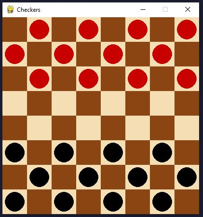

# Checker

    

## App Description:

This is a simple Checkers game implemented using Pygame. The game board consists of an 8x8 grid where pieces can be moved diagonally on dark squares. Players take turns moving their pieces diagonally forward. If a player's piece reaches the opponent's back row, it becomes a "king" and gains additional movement options.

Each player starts with 12 pieces, which are initially arranged on alternating dark squares of the first three rows on their side of the board. The game ends when one player captures all of the opponent's pieces or blocks them from making any legal moves.

Players can interact with the game by clicking on their own pieces to select them and then clicking on valid squares to move them. Valid moves include diagonal steps and jumps over opponent's pieces. The game switches turns automatically after each move. The pieces are represented by circles, and the color of the pieces alternates between black and red.

## Developed Using

